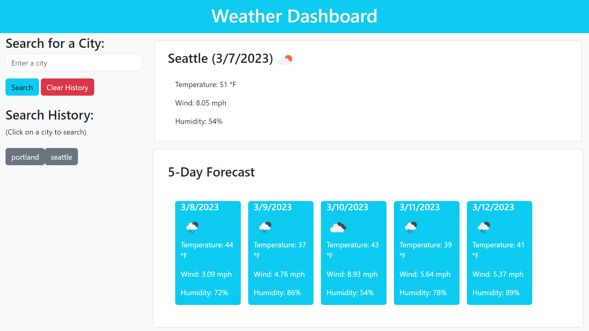

# weather-dashboard

## Description
This application allows a user to search for the weather in a specific city.

The top of the page is a simple header containing the application name.  At the left of the screen is a search form with a search bar and search history.  The bulk of the page is initially empty, but will be comprised of two containers displaying weather data, in imperical units, including temperature, wind speed, and humidity level once a search is performed. The first container displays the current date and weather data for the queried city.  The second container displays the date and weather data forecast for the next five days for that same queried city.

## Appearance

## Functionality
The user can navigate to the search bar at the left of the screen.  Mouse click within the text area and type in the name of a city.  Click on the blue search button to perform a search on the city name.  If the name of an existing city is entered into the text area, then weather data for that city will populate to the page. Otherwise, no weather data will be displayed.

The content of the text area for each search will be saved in the search history section at the left of the screen.  Each will be saved as a unique button that can be clicked in order to perform a new search.  Weather data will be displayed for the specified city concurrent with the time of the new search.  

If the user wishes to clear the search history, simply click on the red clear history button at the left of the screen.

## Programming Tools
* HTML
* Bootstrap
* JavaScript
* jQuery
* OpenWeatherMap API
* Fetch API

## Deployed Application Link
https://paul-runge.github.io/weather-dashboard/